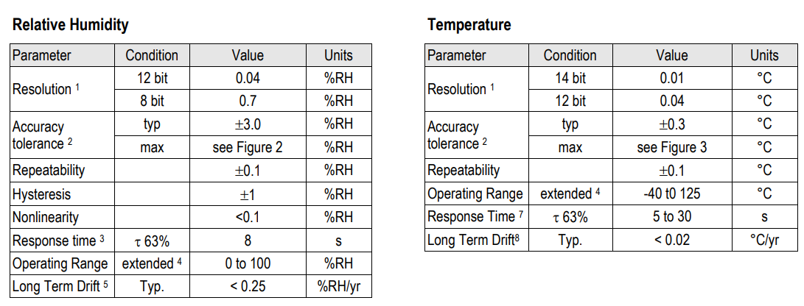
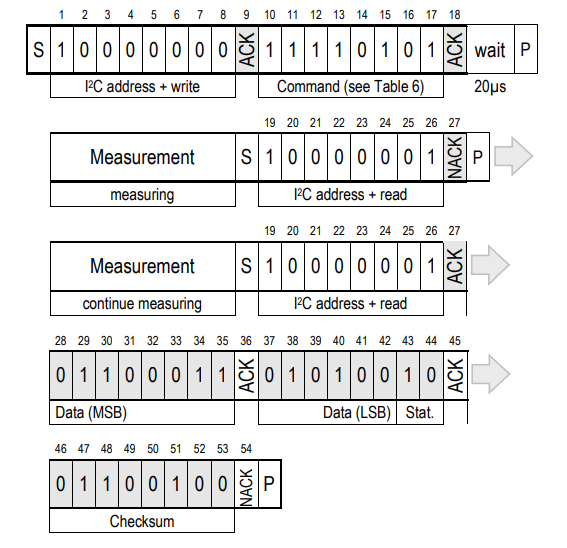
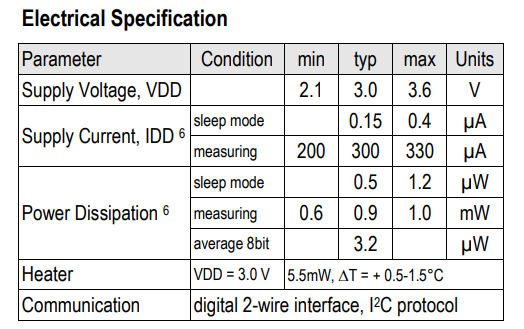

# 一些文字

&nbsp;

## 硬件设计相关

***

### 1.感知层介绍

&emsp;&emsp;感知层是物联网的核心，是信息采集的关键部分。感知层位于物联网三层结构中的最底层，其功能为“感知”，即通过传感网络获取环境信息。感知层是物联网的核心，是信息采集的关键部分。感知层包括二维码标签和识读器、RFID标签和读写器、摄像头、GPS、传感器、M2M 终端、传感器网关等，主要功能是识别物体、采集信息，与人体结构中皮肤和五官的作用类似。一些感知层常见的关键技术如下：

1. 传感器：传感器是物联网中获得信息的主要设备，它利用各种机制把被测量转换为电信号，然后由相应信号处理装置进行处理，并产生响应动作。常见的传感器包括温度、湿度、压力、光电传感器等。
2. RFID：RFID 的全称为 Radio Frequency Identification，即射频识别，又称为电子标签。RFID是一种非接触式的自动识别技术，可以通过无线电讯号识别特定目标并读写相关数据。它主要用来为物联网中的各物品建立唯一的身份标示。
3. 传感器网络：传感器网络是一种由传感器节点组成网络，其中每个传感器节点都具有传感器、微处理器、以及通信单元。节点间通过通信网络组成传感器网络，共同协作来感知和采集环境或物体的准确信息。而无线传感器网络（Wireless Sensor Network，简称WSN），则是目前发展迅速，应用最广的传感器网络。
&nbsp;

### 2.网络层介绍

&emsp;&emsp;网络层作为纽带连接着感知层和应用层，它由各种私有网络、互联网、有线和无线通信网等组成，相当于人的神经中枢系统，负责将感知层获取的信息，安全可靠地传输到应用层，然后根据不同的应用需求进行信息处理。
&emsp;&emsp;物联网网络层包含接入网和传输网，分别实现接入功能和传输功能。传输网由公网与专网组成，典型传输网络包括电信网（固网、移动通信网）、广电网、互联网、电力通信网、专用网（数字集群）。接入网包括光纤接入、无线接入、以太网接入、卫星接入等各类接入方式，实现底层的传感器网络、RFID 网络最后一公里的接入。
&emsp;&emsp;物联网的网络层基本上综合了已有的全部网络形式，来构建更加广泛的“互联”。每种网络都有自己的特点和应用场景，互相组合才能发挥出最大的作用，因此在实际应用中，信息往往经由任何一种网络或几种网络组合的形式进行传输。
&nbsp;

### 3.感知层传感器选型（温湿度检测）

#### SHT20（温湿度传感器）

&emsp;&emsp;SHT20 是由瑞士 Sensirion 推出的数字温湿度传感器，基于领先世界的 CMOSens ® 数字传感技术，具有极高的可靠性和卓越的长期稳定性。全量程标定，两线数字接口，可与单片机直接相连，大大缩短研发时间、简化外围电路并降低费用。此外，体积微小、响应迅速、低能耗、可浸没、抗干扰能力强、温湿一体，兼有露点测量，性价比高，使该产品能够适于多种场合的应用，SHT20 采用 IIC 总线协议，极大地方便了传感器接入各种型号的单片机系统，降低开发难度，节省 GPIO 资源，处理器可直接使用片上 IIC 外设与之进行数据交换，节省 CPU 计算资源，提高系统整体效率，该芯片可以同时进行温湿度信息转换与输出，下图表示湿度与温度的转换精度与转换时间等信息：

    
    
         
        图 1 ：数据采集与转换参数
    

&nbsp;

&emsp;&emsp;SHT20 采用 IIC 总线协议传输，主机通过指定格式与指定延时时间从 SHT20 芯片内读取数据，下图所示为 SHT20 芯片工作在 NO hold 模式（非保持模式）下的主通信序列 - 灰色块由 SHT20 控制。 如果测量不在“读取”命令后完成，传感器不提供 ACK在第 27 位上（更多这样的迭代是可能的）。 如果第 45 位是更改为 NACK 后跟停止条件 (P) 校验和传输被省略。

    
    
         
        图 2 ：SHT20 数据读取传输格式
    

&nbsp;

&emsp;&emsp;读取与计算温度湿度的格式：默认分辨率设置为 12 位相对湿度和 14 位温度读数。测量数据传输两个字节包，即在 8 位长度的帧中最高有效位 (MSB) 首先传输（左对齐）。每个字节后跟一个确认位。 他们的状态位，LSB 的最后一位，必须先设置为 “0” 计算物理值。上图中传输的 16 位相对湿度数据是 ‘0110’0011’0101’0000’ = 25424。

&emsp;&emsp;与相对湿度信号输出SRH的相对湿度 RH 由以下公式获得（结果为%RH），无论选择哪种分辨率：$$ RH=-6+125 \cdot \cfrac{S_{RH}}{2^{16}} $$

&emsp;&emsp;由上述公式得知，使用刚刚的样例数据算得相对湿度为 42.5% RH。

&emsp;&emsp;上面给出的物理值RH对应于根据世界标准，液态水上方的相对湿度气象组织
(WMO)。 对于相对湿度上面的冰 $RH_{i}$ 值需要从温度 $t$ 时水上相对湿度 $RH_{w}$。 下面给出等式，用于比较一下应用说明“湿度简介”：$$ RH_{i}=RH_w \cdot \cfrac{exp(\cfrac{\beta_w \cdot t}{\lambda_w+t})}{exp(\cfrac{\beta_i \cdot t}{\lambda_i+t})} $$

&emsp;&emsp;相对湿度的单位是 %RH，相对湿度的单位是 °C 温度。定义相应的系数如下：$\beta_w$ = 17.62, $\lambda_w$ = 243.12°C, $\beta_i$ = 22.46, $\lambda_i$ = 272.62°C。

&emsp;&emsp;温度 $T$ 是通过插入温度来计算的信号输出 $S_T$ 代入下式（结果单位为°C），无论选择哪种分辨率：$$T=-46.85+175.72 \cdot \cfrac{S_T}{2^{16}}$$

&emsp;&emsp;SHT20 在采样和通信期间均有很好的低功耗效能，根据这一项优点，SHT20 十分适合在各种需要低功耗的带电池或使用能量采集器来供能的物联网设备节点。下图为 SHT20 芯片的电气特性：

    
    
         
        图 3 ：SHT20 电气特性
    

&nbsp;

&emsp;&emsp;由于 SHT20 的协议成熟，使用方便，转换和响应速度快，以及最重要的低功耗特点，本设计选用该芯片作为传感器节点的温湿度测量芯片。
&nbsp;

### 3.网络层的硬件介绍

#### (1) ESP32-C3-Wifi 库

&emsp;&emsp;ESP32 系列芯片具有 WiFi，ble，蓝牙等多种无线能力，乐鑫在 SDK 中提供了多种必要的 API 其中，Wi-Fi 库支持配置及监控 ESP32 Wi-Fi 连网功能。支持以下多种配置：

1. 基站模式（即 STA 模式或 Wi-Fi 客户端模式），此时 ESP32 连接到接入点 (AP)。
2. AP 模式（即 Soft-AP 模式或接入点模式），此时基站连接到 ESP32。
3. AP-STA 共存模式（ESP32 既是接入点，同时又作为基站连接到另外一个接入点）。
4. 上述模式的各种安全模式（WPA、WPA2 及 WEP 等）。
5. 扫描接入点（包括主动扫描及被动扫描）。
6. 使用混杂模式监控 IEEE802.11 Wi-Fi 数据包。

&emsp;&emsp;使用 ESP32 的 WiFi 库配置 WiFi 连接需要如下几个阶段：

##### ① Wi-Fi/LwIP 初始化阶段

1. 主任务通过调用函数 `esp_netif_init()` 创建一个 LwIP 核心任务，并初始化 LwIP 相关工作。
2. 主任务通过调用函数 `esp_event_loop_create()` 创建一个系统事件任务，并初始化应用程序事件的回调函数。在此情况下，该回调函数唯一的动作就是将事件中继到应用程序任务中。
3. 主任务通过调用函数 `esp_netif_create_default_wifi_ap()` 或 `esp_netif_create_default_wifi_sta()` 创建有 TCP/IP 堆栈的默认网络接口实例绑定 station 或 AP。
4. 主任务通过调用函数 `esp_wifi_init()` 创建 Wi-Fi 驱动程序任务，并初始化 Wi-Fi 驱动程序。
5. 主任务通过调用 OS API 创建应用程序任务。

&emsp;&emsp;乐鑫官方推荐按照上述 1 ~ 5 的步骤顺序针对基于 Wi-Fi/LwIP 的应用程序进行初始化。但这一顺序 并非强制，可以在第 1 步创建应用程序任务，然后在该应用程序任务中进行所有其它初始化操作。不过，如果应用程序任务依赖套接字，那么在初始化阶段创建应用程序任务可能并不适用。此时，可以在接收到 IP 后再进行任务创建。

##### ② Wi-Fi 配置阶段

&emsp;&emsp;Wi-Fi 驱动程序初始化成功后，可以进入到配置阶段。该场景下，Wi-Fi 驱动程序处于 station 模式。因此，首先需调用函数 `esp_wifi_set_mode()` (WIFI_MODE_STA) 将 Wi-Fi 模式配置为 station 模式。可通过调用其它 `esp_wifi_set_xxx` API 进行更多设置，例如：协议模式、国家代码、带宽等。

&emsp;&emsp;一般情况下会在建立 Wi-Fi 连接之前配置 Wi-Fi 驱动程序，但这并非强制要求。也就是说，只要 Wi-Fi 驱动程序已成功初始化，便可以在任意阶段进行配置。但是，如果主程序 Wi-Fi 在建立连接后不需要更改配置，则应先在此阶段完成配置。因为调用配置 API（例如 `esp_wifi_set_protocol()`）将会导致 Wi-Fi 连接断开，为系统的操作带来不便。

&emsp;&emsp;如果 menuconfig 已使能 Wi-Fi NVS flash，则不论当前阶段还是后续的 Wi-Fi 配置信息都将被存储至该 flash 中。那么，当主板上电/重新启动时，就不需从头开始配置 Wi-Fi 驱动程序。只需调用函数 `esp_wifi_get_xxx` API 获取之前存储的配置信息。当然，如果不想使用之前的配置，依然可以重新配置 Wi-Fi 驱动程序。

##### ③ Wi-Fi 启动阶段

1. 调用函数 `esp_wifi_start()` 启动 Wi-Fi 驱动程序。
2. Wi-Fi 驱动程序将事件 WIFI_EVENT_STA_START 发布到事件任务中，然后，事件任务将执行一些正常操作并调用应用程序的事件回调函数。
3. 应用程序的事件回调函数将事件 WIFI_EVENT_STA_START 中继到应用程序任务中。乐鑫推荐此时调用函数 `esp_wifi_connect()` 进行 Wi-Fi 连接。或者也可以等待在 WIFI_EVENT_STA_START 事件发生后的其它阶段再调用此函数。

##### ④ Wi-Fi 连接阶段

1. 调用函数 esp_wifi_connect() 后，Wi-Fi 驱动程序将启动内部扫描/连接过程。
2. 如果内部扫描/连接过程成功，将产生 WIFI_EVENT_STA_CONNECTED 事件。然后，事件任务将启动 DHCP 客户端服务，最终触发 DHCP 程序。
3. 在此情况下，应用程序的事件回调函数会将 WIFI_EVENT_STA_CONNECTED 事件中继到应用程序任务中。通常，应用程序不需进行操作，而用户可以执行任何动作，例如：打印日志等。

&emsp;&emsp;上述步骤 2 中 Wi-Fi 连接可能会由于某些原因而失败，例如：密码错误、未找到 AP 等。这种情况下，将引发 WIFI_EVENT_STA_DISCONNECTED 事件并提示连接错误原因。我们需要按照指定方式添加自己的用户代码来处理此类连接错误。

##### ⑤ Wi-Fi 获取 IP 阶段

1. 一旦上阶段步骤 2 中的 DHCP 客户端初始化完成，Wi-Fi 驱动程序将进入 获取 IP 阶段。
2. 如果 Wi-Fi 成功从 DHCP 服务器接收到 IP 地址，则将引发 IP_EVENT_STA_GOT_IP 事件，事件任务将执行正常处理。
3. 应用程序的事件回调函数将事件 IP_EVENT_STA_GOT_IP 中继到应用程序任务中。对于那些基于 LwIP 构建的应用程序，此事件较为特殊，因为它意味着应用程序已准备就绪，可以开始任务，例如：创建 TCP/UDP 套接字等。此时较为容易犯的一个错误就是在接收到 IP_EVENT_STA_GOT_IP 事件之前就初始化套接字。此时不能在接收到 IP 之前启动任何套接字相关操作。

&emsp;&emsp;以上五个阶段便是 ESP32-C3 芯片连接 WiFi-AP 的全过程。
