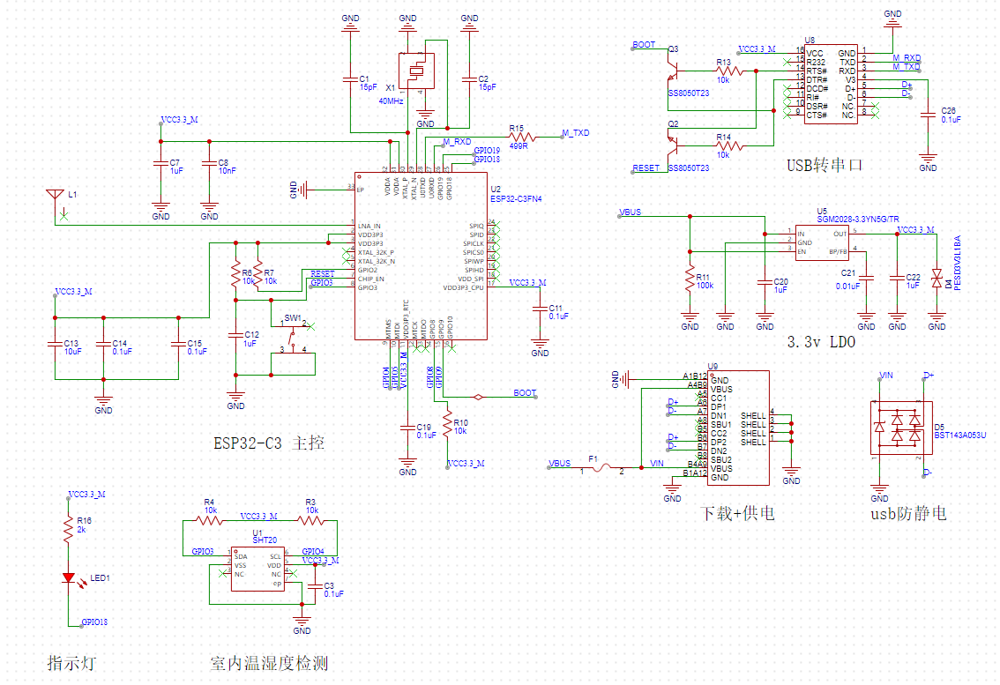

# 章节

&nbsp;

## 第三章

### 3.1 网关总体目标

***

&emsp;&emsp;本论文目的是通用物联网网关的研究和设计，即设计这样一个系统，它能够使得使用不同网络协议的物联网设备和应用软件得以实现数据交换，如将分别使用 MQTT 协议，ZigBee 协议，基础 TCP 协议，HTTP 协议的低功耗设备节点或移动端以及服务器端的应用软件通过该网关实现互相通信，数据分发，计算以及自动控制。本论文设计的网关将接受物联网设备节点以 MQTT 协议上传的各项传感器数据，并将该数据以 HTTP 等协议发送至指定终端设备以及服务器端应用软件。并且连接至该网关的应用软件可以将控制指令以 HTTP 等协议发送至该网关，用来改变对传感器节点数据的处理方式以及设置网关参数，系统整体的数据交换通路如下图所示：

<center>
    
    <font size=2>
        <br>
        图 1 ：数据通路
    </font>
</center>
&nbsp;

&emsp;&emsp;该网关将要实现的具体功能为：由于需要接收基于 MQTT 协议的物联网传感器设备节点上传的传感器数据，网关系统需要首先运行一个 MQTT 的 broker（代理服务），并在该 broker 中配置好设备传感器上报数据所需要的 Topic，为了将接收到的 MQTT 数据进一步分发，网关还需要部署基于 Node-Red 的消息传递通路，以实现数据的 HTTP 转发与 HTTP 接收。

&nbsp;

### 3.3 系统架构

***

&emsp;&emsp;该系统总体分为两大部分，第一部分是用于接收 MQTT 数据的 broker，本系统采用 EMQX 来部署 MQTT broker，EMQX 有诸多优点，其一是 EMQX 基于 Apache 2.0 许可证完全开源，并且自 2013 年至今经历了 200 多个版本迭代，方便移植和定制 MQTT 服务以适用于不同的服务器平台，并且 EMQX 基于 OTP 软实时的运行时系统设计，消息分发与投递时延低于 1 毫秒，单节点支持 500 万 MQTT 设备连接，单节点支持每秒实时接收、移动、处理与分发数百万条的 MQTT 消息等诸多优点，这些优点使得 EMQX 可以轻松接收和并发处理海量传感器数据并且有极低的延迟，因此其应用场景十分广泛，十分适合作为通用物联网网关的 MQTT broker，丰富的可扩展性令 EMQX 可以运行在 PC 主机、虚拟机，或嵌入式 Linux 平台上，因此本设计使用 EMQX 来部署 MQTT broker 作为传感器数据采集的第一站。

&emsp;&emsp;本设计第二大部分为数据处理与多协议数据分发通路，该部分采用 Node-RED 软件部署数据链路，Node-RED 是构建物联网 (IOT， Internet of Things) 应用程序的一个强大工具，其重点是简化代码块的“连接”以执行任务。它使用可视化编程方法，允许开发人员将预定义的代码块（称为“节点”，Node）连接起来执行任务。连接的节点，通常是输入节点、处理节点和输出节点的组合，当它们连接在一起时，构成一个“流”(Flows)。这种低代码的数据流搭建方式极大方便了物联网应用的开发，只需要在 Node-RED 中建立好对指定 MQTT broker 的某个主题的订阅，实现对传感器设备上传的数据的监听，并且使用函数自带的 funtion 节点写好数据处理算法，最后通过建立 HTTP 服务或 TCP 服务即可完成数据分发，Node-RED 作为部署 web 服务的利器，十分适合通用物联网网关的快速搭建或者快速修改服务逻辑，大大缩短网关的后续维护与迭代。

&emsp;&emsp;本设计即为基于 EMQX 与 Node-RED 软件的通用物联网网关，网关系统整体架构如下所示，传感器设备数据首先上报至 EMQX broker，部署 broker 后，Node-RED 通过订阅 EMQX broker 中指定主题从而获得传感器数据，经过编写好的 function 算法节点，数据通过多种协议分发至 HTTP 应用或 TCP 应用程序。

<center>
    
    <font size=2>
        <br>
        图 2 ：系统架构
    </font>
</center>
&nbsp;

## 第四章

### 4.2 网关详细设计

***
&emsp;&emsp;作为接收设备节点上报的温湿度采集数据的第一站，本网关系统采用开源的 EMQX 部署 broker，在 PC 上下载并安装 EMQX 的 windows 版本，在软件目录下开启控制台输入命令：

```C
./emqx start  
```

&emsp;&emsp;以此成功启动 EMQX 服务，在本机浏览器中键入该网址进入 EMQX 后台进行管理：

```C
127.0.0.1:18083
```

<center>
    
    <font size=2>
        <br>
        图 3 ：管理页面
    </font>
</center>
&nbsp;

### 4.3 物联网设备节点设计

***

&emsp;&emsp;网关设计完成后需要相应的硬件传感器设备作连接测试，本系统采用的硬件传感器设备整体架构如下图所示：

<center>
    
    <font size=2>
        <br>
        图  ：系统架构
    </font>
</center>
&nbsp;

&emsp;&emsp;该传感器节点作为物联网网关的通讯测试用，因此电源采用 typec 接口直接取电，温湿度数据来源为 SHT20 芯片，ESP32-C3 通过 IIC 总线读取数据，板载一个复位按键，一个 LED 灯（用来指示网络连接状态），另外板载 2.4GHz 陶瓷天线用来连接 WiFi 进而连接 MQTT 服务器并订阅主题最终实现传感器数据的上报，节点设备的硬件原理图如下：

<center>
    
    <font size=2>
        <br>
        图  ：原理图
    </font>
</center>
&nbsp;

&emsp;&emsp;节点设备采用了 ESP32-C3 作为主控处理器，兼顾低功耗和自带 WiFi 协议栈，MQTT 协议栈等优点，另外本身支持开源的 FreeRTOS 操作系统，使得各个任务（WiFi 连接，MQTT 订阅与数据上报，SHT20 温湿度采集等）能够协调运行，互不干扰。

&emsp;&emsp;节点设备的 SHT20 温湿度传感器代码如下：

```C
// 复位芯片
void sht20_reset(void)
{
    uint8_t sht20_dat[1] = {SHT20_COMMAND_RESET};
    i2c_send(SHT20_ADDRESS, sht20_dat, sizeof(sht20_dat));
}

// 启动温度转换
void sht20_trigger_T(void)
{
    uint8_t sht20_dat[1] = {SHT20_COMMAND_TRIGGER_T};
    i2c_send(SHT20_ADDRESS, sht20_dat, sizeof(sht20_dat));
}

// 启动湿度转换
void sht20_trigger_RH(void)
{
    uint8_t sht20_dat[1] = {SHT20_COMMAND_TRIGGER_RH};
    i2c_send(SHT20_ADDRESS, sht20_dat, sizeof(sht20_dat));
}

// 读取转换后的温度值
esp_err_t sht20_recive_T(float *c_temp)
{
    float current_T = 0;
    uint8_t sht20_dat[3] = {0};
    esp_err_t sht_sta = ESP_OK;
    sht_sta = i2c_read(SHT20_ADDRESS, sht20_dat, sizeof(sht20_dat));

    if (sht_sta != ESP_OK)
        return sht_sta;
    else
    {
        current_T = ((float)sht20_dat[0] * 256 + (float)sht20_dat[1]) * 175.72 / 65536 - 46.85;
        *c_temp = current_T;
    }
    return sht_sta;
}

// 读取转换后的湿度值
esp_err_t sht20_recive_RH(float *c_rh)
{
    float current_RH = 0;
    uint8_t sht20_dat[3] = {0};
    esp_err_t sht_sta = ESP_OK;
    sht_sta = i2c_read(SHT20_ADDRESS, sht20_dat, sizeof(sht20_dat));

    if (sht_sta != ESP_OK)
        return sht_sta;
    else
    {
        current_RH = ((float)sht20_dat[0] * 256 + (float)(sht20_dat[1]&0XFC)) * 125 / 65536 - 6;
        *c_rh = current_RH;
    }
    return sht_sta;
}
```

&emsp;&emsp;节点设备的 WiFi 连接代码如下：

```C
// WiFi 连接事件回调函数，用于处理 WiFi 连接、断连、获取 IP 等
static void wifi_connect_event_handler(void *arg, esp_event_base_t event_base,
                          int32_t event_id, void *event_data)
{
    if (event_base == WIFI_EVENT && event_id == WIFI_EVENT_STA_START)
    {
        esp_wifi_connect();
    }
    else if (event_base == WIFI_EVENT && event_id == WIFI_EVENT_STA_DISCONNECTED)
    {
        xEventGroupClearBits(s_wifi_event_group, WIFI_CONNECTED_BIT);
        if (s_retry_num < WIFI_MAX_RETRY)
        {
            esp_wifi_connect();
            s_retry_num++;
            ESP_LOGI(TAG, "retry to connect to the AP");
        }
        else
        {
            xEventGroupSetBits(s_wifi_event_group, WIFI_FAIL_BIT);
        }
        ESP_LOGI(TAG, "connect to the AP fail");
    }
    else if (event_base == IP_EVENT && event_id == IP_EVENT_STA_GOT_IP)
    {
        ip_event_got_ip_t *event = (ip_event_got_ip_t *)event_data;
        ESP_LOGI(TAG, "got ip:" IPSTR, IP2STR(&event->ip_info.ip));
        s_retry_num = 0;
        xEventGroupSetBits(s_wifi_event_group, WIFI_CONNECTED_BIT);
    }
}

// 初始化 WiFi 连接，配置 WiFi 参数，设置回调函数等
void wifi_init_sta(void)
{
    s_wifi_event_group = xEventGroupCreate();

    ESP_ERROR_CHECK(esp_netif_init());

    ESP_ERROR_CHECK(esp_event_loop_create_default());
    esp_netif_create_default_wifi_sta();

    wifi_init_config_t cfg = WIFI_INIT_CONFIG_DEFAULT();
    ESP_ERROR_CHECK(esp_wifi_init(&cfg));

    esp_event_handler_instance_t instance_any_id;
    esp_event_handler_instance_t instance_got_ip;
    ESP_ERROR_CHECK(esp_event_handler_instance_register(WIFI_EVENT,
                                                        ESP_EVENT_ANY_ID,
                                                        &wifi_connect_event_handler,
                                                        NULL,
                                                        &instance_any_id));
    ESP_ERROR_CHECK(esp_event_handler_instance_register(IP_EVENT,
                                                        IP_EVENT_STA_GOT_IP,
                                                        &wifi_connect_event_handler,
                                                        NULL,
                                                        &instance_got_ip));

    wifi_config_t wifi_config = {
        .sta = {
            .ssid = WIFI_SSID,
            .password = WIFI_PASSWORD,
            .threshold.authmode = WIFI_THRESHOLD_AUTHMODE,
            .sae_pwe_h2e = WPA3_SAE_PWE_BOTH,
        },
    };
    ESP_ERROR_CHECK(esp_wifi_set_mode(WIFI_MODE_STA));
    ESP_ERROR_CHECK(esp_wifi_set_config(WIFI_IF_STA, &wifi_config));
    ESP_ERROR_CHECK(esp_wifi_start());

    ESP_LOGI(TAG, "wifi_init_sta finished.");

    EventBits_t bits = xEventGroupWaitBits(s_wifi_event_group,
                                           WIFI_CONNECTED_BIT | WIFI_FAIL_BIT,
                                           pdFALSE,
                                           pdFALSE,
                                           portMAX_DELAY);

    if (bits & WIFI_CONNECTED_BIT)
    {
        ESP_LOGI(TAG, "connected to ap SSID:%s password:%s",
                 WIFI_SSID, WIFI_PASSWORD);
    }
    else if (bits & WIFI_FAIL_BIT)
    {
        ESP_LOGI(TAG, "Failed to connect to SSID:%s, password:%s",
                 WIFI_SSID, WIFI_PASSWORD);
    }
    else
    {
        ESP_LOGE(TAG, "UNEXPECTED EVENT");
    }
}
```

&emsp;&emsp;节点设备 MQTT 客户端配置代码：

```C
// MQTT 客户端断连处理回调
static void log_error_if_nonzero(const char *message, int error_code)
{
    if (error_code != 0)
    {
        ESP_LOGE(TAG, "Last error %s: 0x%x", message, error_code);
    }
}

// MQTT 连接 broker 事件处理回调函数
static void mqtt_event_handler(void *handler_args, esp_event_base_t base, int32_t event_id, void *event_data)
{
    ESP_LOGD(TAG, "Event dispatched from event loop base=%s, event_id=%" PRIi32 "", base, event_id);
    esp_mqtt_event_handle_t event = event_data;
    esp_mqtt_client_handle_t client = event->client;
    int msg_id;
    switch ((esp_mqtt_event_id_t)event_id)
    {
    case MQTT_EVENT_CONNECTED:
        ESP_LOGI(TAG, "MQTT_EVENT_CONNECTED");
        msg_id = esp_mqtt_client_publish(client, "/topic/qos1", "data_3", 0, 1, 0);
        ESP_LOGI(TAG, "sent publish successful, msg_id=%d", msg_id);

        msg_id = esp_mqtt_client_subscribe(client, "/topic/qos0", 0);
        ESP_LOGI(TAG, "sent subscribe successful, msg_id=%d", msg_id);

        msg_id = esp_mqtt_client_subscribe(client, "/topic/qos1", 1);
        ESP_LOGI(TAG, "sent subscribe successful, msg_id=%d", msg_id);

        msg_id = esp_mqtt_client_unsubscribe(client, "/topic/qos1");
        ESP_LOGI(TAG, "sent unsubscribe successful, msg_id=%d", msg_id);
        break;
    case MQTT_EVENT_DISCONNECTED:
        ESP_LOGI(TAG, "MQTT_EVENT_DISCONNECTED");
        break;

    case MQTT_EVENT_SUBSCRIBED:
        ESP_LOGI(TAG, "MQTT_EVENT_SUBSCRIBED, msg_id=%d", event->msg_id);
        msg_id = esp_mqtt_client_publish(client, "/topic/qos0", "data", 0, 0, 0);
        ESP_LOGI(TAG, "sent publish successful, msg_id=%d", msg_id);
        break;
    case MQTT_EVENT_UNSUBSCRIBED:
        ESP_LOGI(TAG, "MQTT_EVENT_UNSUBSCRIBED, msg_id=%d", event->msg_id);
        break;
    case MQTT_EVENT_PUBLISHED:
        ESP_LOGI(TAG, "MQTT_EVENT_PUBLISHED, msg_id=%d", event->msg_id);
        break;
    case MQTT_EVENT_DATA:
        ESP_LOGI(TAG, "MQTT_EVENT_DATA");
        printf("TOPIC=%.*s\r\n", event->topic_len, event->topic);
        printf("DATA=%.*s\r\n", event->data_len, event->data);
        break;
    case MQTT_EVENT_ERROR:
        ESP_LOGI(TAG, "MQTT_EVENT_ERROR");
        if (event->error_handle->error_type == MQTT_ERROR_TYPE_TCP_TRANSPORT)
        {
            log_error_if_nonzero("reported from esp-tls", event->error_handle->esp_tls_last_esp_err);
            log_error_if_nonzero("reported from tls stack", event->error_handle->esp_tls_stack_err);
            log_error_if_nonzero("captured as transport's socket errno", event->error_handle->esp_transport_sock_errno);
            ESP_LOGI(TAG, "Last errno string (%s)", strerror(event->error_handle->esp_transport_sock_errno));
        }
        break;
    default:
        ESP_LOGI(TAG, "Other event id:%d", event->event_id);
        break;
    }
}

// 启动 MQTT 客户端，连接目标 broker
static void mqtt_app_start(void)
{
    esp_mqtt_client_config_t mqtt_cfg = {
        // .broker.address.uri = MQTT_BROKER_URL,
        .broker.address.hostname = MQTT_HOSTNAME,
        .broker.address.port = MQTT_HOSTPORT,
        .credentials.username = MQTT_USERNAME,
        .credentials.authentication.password = MQTT_PASSWORD,
    };

    esp_mqtt_client_handle_t client = esp_mqtt_client_init(&mqtt_cfg);
    /* The last argument may be used to pass data to the event handler, in this example mqtt_event_handler */
    esp_mqtt_client_register_event(client, ESP_EVENT_ANY_ID, mqtt_event_handler, NULL);
    esp_mqtt_client_start(client);
}
```
